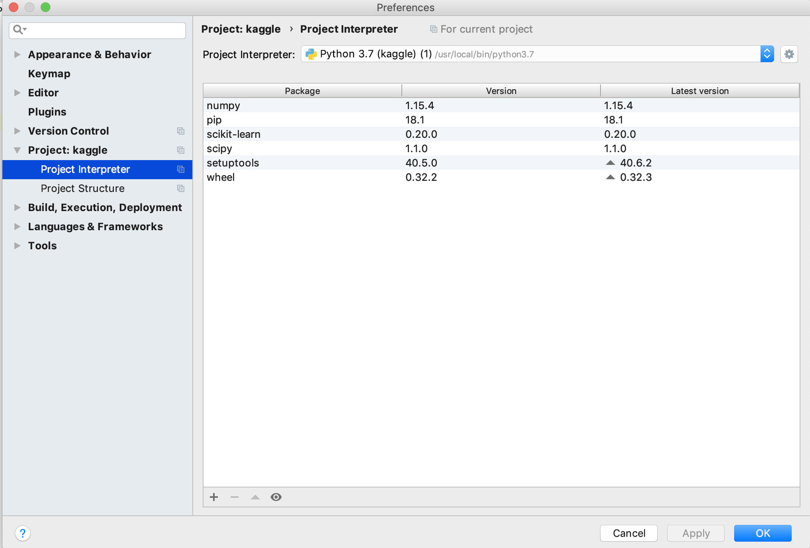
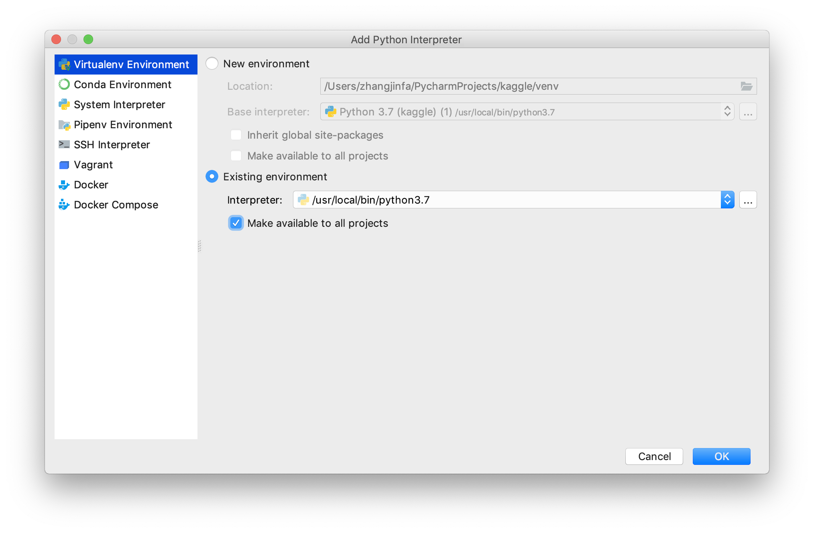

# PyCharm

## Python解析器配置

使用 PyCharm 开发时, 首先需要配置好我们需要的 Python 解析器环境. 通常情况下, 我们会在本机构建自己的 Python 环境, 这样能够方便的使用 pip 等进行组件的管理.
这种情况下, 我们也需要设置 PyCharm 使用本机的 Python 环境, 以确保在本机中的各种包可以被引用到项目中.

使用 `command + ,` 打开配置项, 进入到解析器配置页面:

选择右上角 齿轮 图标, 添加新的解析器选项: 选择 `exists environment`, 并选择本地 Python

